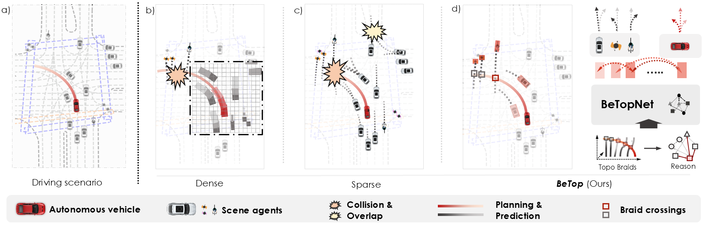
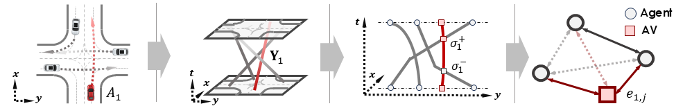

<h1 align="center"> BeTop: Reasoning Multi-Agent Behavioral Topology 
for Interactive Autonomous Driving </h1> 

<div id="top" align="center">
<p align="center">

</p>
</div>

> - [Haochen Liu](https://scholar.google.com/citations?user=iizqKUsAAAAJ&hl), [Li Chen](https://scholar.google.com/citations?user=ulZxvY0AAAAJ&hl=zh-CN), Yu Qiao, Chen Lv and Hongyang Li
> 
> - If you have any questions, please feel free to contact: *Haochen Liu* ( haochen002@e.ntu.edu.sg )

<!-- > 📜 Preprint: <a href="https://arxiv.org/abs/2409.09016">"></a> -->


Full code and checkpoints release is coming soon. Please stay tuned.

## Overview

**BeTop**  leverages braid theory to model multi-agent future behaviors in autonomous driving;

<div id="top" align="center">
<p align="center">

</p>
</div>

The synergetic framework, *BeTopNet*, integrates topology reasoning with prediction and planning tasks for autonomous driving.

<div id="top" align="center">
<p align="center">

</p>
</div>

## TODO list

- [x] Initial release
- [ ] Prediction pipeline in WOMD
- [ ] Planning pipeline in nuPlan

## Citation

If you find the project helpful for your research, please consider citing our paper:

```bibtex
@inproceedings{liu2024betop,
 title={Reasoning Multi-Agent Behavioral Topology for Interactive Autonomous Driving}, 
 author={Haochen Liu and Li Chen and Yu Qiao and Chen Lv and Hongyang Li},
 booktitle={NeurIPS},
 year={2024}
}
```
